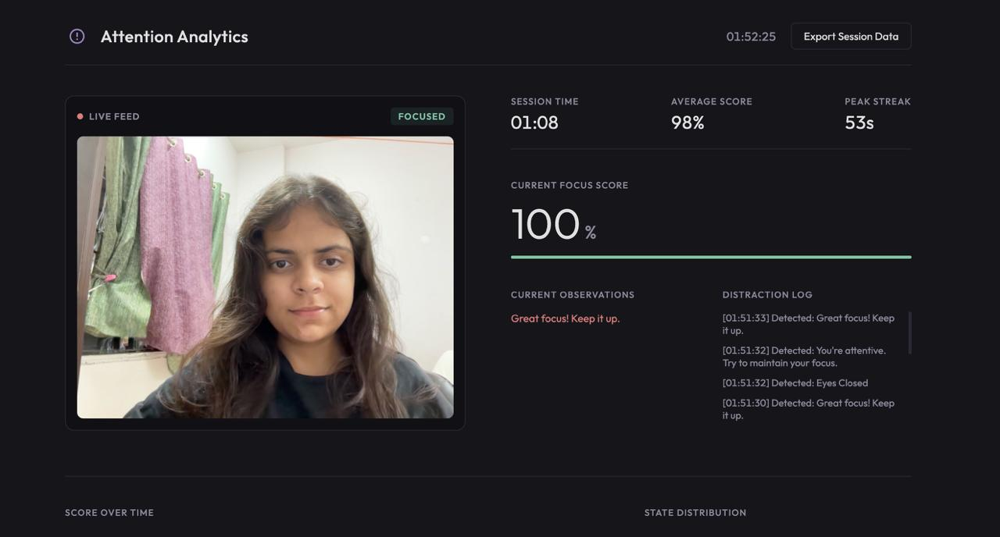
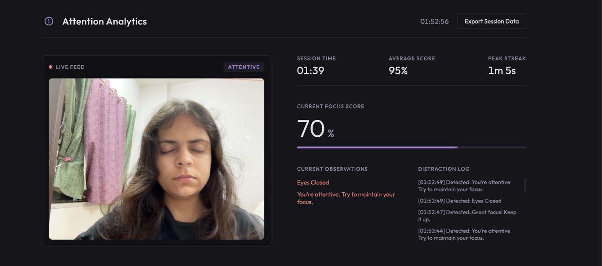
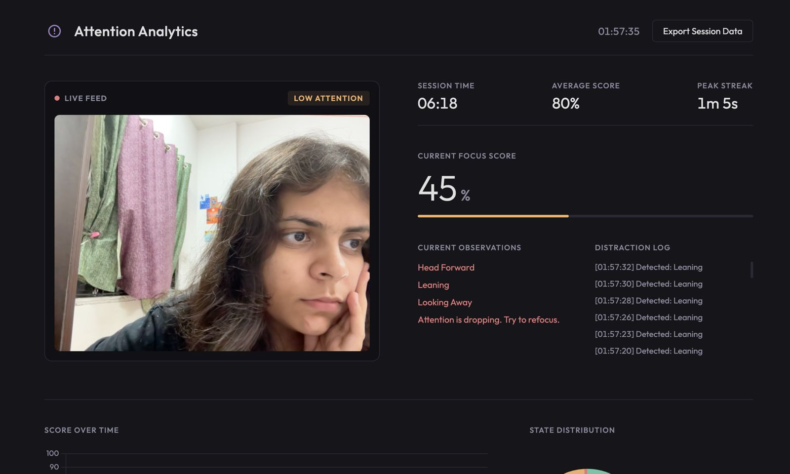
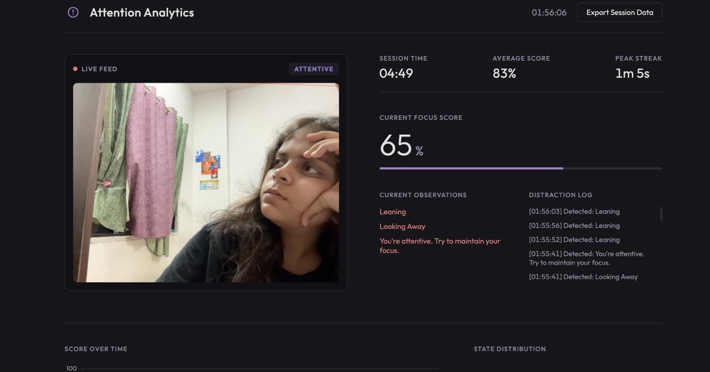
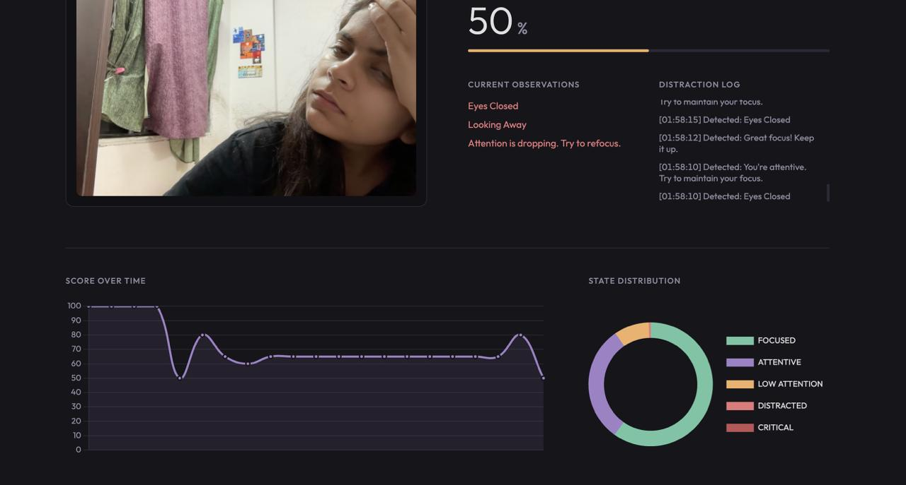

# Attention-Monitoring-CV
## Author

**Unnati Singh**
## Registration Number
** 24BAI10625**

## Abstract

This project presents a real-time, web-based attention monitoring system that uses computer vision to analyze facial behavior and body posture through a standard webcam. The system detects visual indicators such as eye closure, head direction, posture changes, yawning, and absence of a detected face. These observations are combined using a rule-based scoring mechanism to estimate the user's attention level and provide feedback.

The system does not require a training dataset. Instead, it uses facial and pose landmarks extracted using MediaPipe and processes them using OpenCV and Python.

## Problem Statement

Maintaining attention during prolonged screen interaction can be challenging in educational and professional environments. This project aims to develop a lightweight system that can monitor visible indicators of attention using only a standard webcam, without requiring specialized hardware or a large training dataset.

## Objectives

- To detect human posture in real time
- To analyze facial behavioral cues using facial landmarks
- To detect eye closure and head direction
- To identify posture-related issues such as head-forward position and leaning
- To calculate an attention score from detected conditions
- To classify attention into different states
- To provide real-time feedback through a web dashboard

## System Architecture

Webcam → Frame Capture using OpenCV → MediaPipe Pose + Face Mesh → Landmark Extraction → Feature Analysis → Rule-Based Scoring → Attention State & Feedback → Flask Web Dashboard

## Methodology

### 1. Frame Capture

The system receives frames from the user's webcam. OpenCV is used for image acquisition and processing.

### 2. Landmark Detection

MediaPipe Pose and Face Mesh are used to identify relevant body and facial landmarks.

The system uses these landmarks to analyze:

- Nose and shoulder positions
- Eye openness
- Mouth opening
- Facial direction
- Shoulder alignment

### 3. Feature Analysis

The extracted landmarks are used to identify visible attention-related conditions such as:

- Eyes closed
- Looking away
- Head-forward position
- Slouching
- Leaning
- Yawning
- Face not detected

Both eyes are considered when evaluating eye closure.

### 4. Attention Scoring

The system starts with an attention score of 100. Penalties are applied when specific conditions are detected.

The final score is constrained to the range:

**0–100**

### 5. Attention State Classification

The final score is mapped to an attention state:

- **Focused**
- **Attentive**
- **Low Attention**
- **Distracted**
- **Critical**

### 6. Feedback Generation

Based on the calculated score, the system generates feedback such as maintaining focus, refocusing attention, or addressing detected distraction.

## Features

- Real-time webcam-based monitoring
- Facial landmark analysis
- Pose and posture analysis
- Two-eye closure detection
- Looking-away detection
- Head-forward detection
- Slouching and leaning detection
- Face-not-detected handling
- Attention score from 0–100
- Attention state classification
- Personalized feedback
- Web-based dashboard
- No training dataset required

## Technologies Used

- Python
- OpenCV
- MediaPipe
- Flask
- NumPy
- HTML
- CSS
- JavaScript

## How to Run

### 1. Clone the repository

    git clone https://github.com/Unnati-Singh-39/Attention-Monitoring-CV.git
### 2. Navigate to the project directory

    cd Attention-Monitoring-CV

### 3. Create and activate a virtual environment

    python3.10 -m venv venv
    source venv/bin/activate

### 4. Install dependencies

    pip install -r requirements.txt

### 5. Run the application

    python app.py

### 6. Open the application

Open the following address in your browser:

    http://127.0.0.1:5001

Allow webcam access when prompted.

## Project Structure

    AI-attention-monitoring-system/
    │
    ├── app.py
    ├── src/
    │   └── detector.py
    ├── templates/
    │   └── index.html
    ├── static/
    │   └── style.css
    ├── outputs/
    │   ├── focused.jpeg
    │   ├── eyes_closed.jpeg
    │   ├── head_forward.jpeg
    │   ├── looking_away.jpeg
    │   └── graph.jpeg
    ├── requirements.txt
    ├── .gitignore
    └── README.md

## Output Demonstration

### Focused State

### Eyes Closed

### Head Forward

### Looking Away

### Dashboard Graph

## Results

The implemented system successfully processes webcam frames in real time and provides an attention score, attention state, and issue-specific feedback based on detected visual conditions.

Testing was performed using different facial and posture conditions, including focused attention, eye closure, head-forward position, and looking away.

## Limitations

- The system uses rule-based thresholds rather than a trained machine-learning model.
- Detection performance can be affected by lighting and camera quality.
- Facial landmark detection may become less reliable when the face is partially occluded.
- Attention is estimated from visible behavioral cues and does not represent a direct measurement of a person's cognitive state.

## Future Scope

- Adaptive thresholds based on individual users
- Historical attention analytics
- Improved head-pose estimation
- Deep-learning-based behavioral classification
- Audio alerts for prolonged distraction
- Improved robustness under different lighting conditions

## Conclusion

This project demonstrates a lightweight computer-vision approach for real-time attention monitoring using webcam input. By combining facial and pose landmark analysis with rule-based scoring, the system provides interpretable attention states and feedback without requiring a training dataset.

